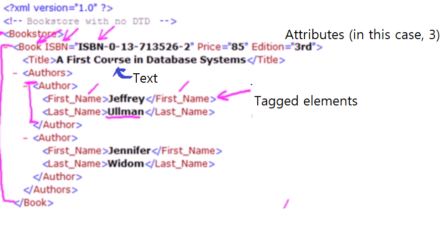

Database Stanford Dbclass
=======
This file summary about stanford dbclass uploaded [here](https://www.youtube.com/playlist?list=PL6hGtHedy2Z4EkgY76QOcueU8lAC4o6c3).  

## Context
* [1-1](#1-1-introduction) Introduction    
* [2-1](#2-1-relational-model) Relational model  
* [2-2](#2-2-querying-relational-databases) Querying relational databases  
* [3-1](#3-1-well-formed-xml) Well-formed xml
---

## 1-1. introduction
### Database Management system (DBMS)
provides
1. massive
2. persistent
3. safe: about hardware, software, power, user failure
4. multi-user: concurrency control
5. convenient
    - physical data independence: data에 가해지는 operation이 data의 물리적 저장방식 (ex. disk)과 무관
    - high-level query language declarative: 간단한 방식으로 query할 수 있음
6. efficient
    - thousands of queries updates per seconds
7. reliable

### Key concepts
* Data model
    - set of records, 
    - XML
    - graph
* Schema cs datas
    : e.g. types v.s variables
* Data definition language (DDL)
    : set up schema
* Data manipulation or query language (DML)
    : quering and modifying

### Key people
* DBMS implementer: builds system (Not scope of this course)
* Database designer: establishes schema
* DB application developer: programs that operate on database
* Database administrator: load data, keeps manages smoothly

## 2-1. relational model
### Database

* set of named relations (tables)
* Each relation has a set of named attributes (or columns)
* Each table (row) has a value for each attribute
* Each attribute has a type (or domain)
    * ex. numerical, atomic, ...

(Example of table)

* key: 모든 tuple을 특정할 수 있는 attribute나 set of attributes

## 2-2. Querying relational databases
### Step in creating and using a relational databases

1. Desigh schema: create using DDL
2. Bulk load initial data
3. repeat: execute queries and modification

### Query languages
* relational algebra: formal
* SQL: actual / implemented

## 3-1. Well-formed xml
### XML
- Extensible Markup Language
- standard for data representation and exchange
- similar to HTML
    * 다른점: Tag가 formatting이 아니고 contents
- Basic constructs
    - Tagged elements (nested)
    - attributes
    - text  

### Relational model v.s XML
|      |Relational|XML|
|------|---|---|
|Structure|Tables|Hierarchical, Tree, graph|
|Schema|Fixed in advance|Flexible, self-describing|
|Queries|Simple, nice|less so|
|Ordering|None|Implied|
|Implementation|Native|Add-on|

### Well-formed XML
다음 basic structural requirements를 준수함
> 1. single root element
> 2. matched tags, proper nesting
> 3. unique attribute swithin elements

### Displaying XML
use rule-based language to translate to HTML such as
- CSS
- XSL

단, translate 전에 well-formed structure를 충족해야 함