Hypothesis testing and ANOVA
======================
## Hypothesis testing
* 목적: 2개의 상반되는 형식적 가설을 검증
    * $H_0$ and $H_a$
    * 2개의 가설은 mutually exclusive & exhaustive
* 어떤 가설이 참이고 거짓인지 판별하기 위해 데이터를 수집한 후 표본데이터를 바탕으로 귀무가설이 옳은지 아닌지 판단
* 설문이나 실험 결과가 유의미한지 판별

## The Null and Alternative Hypothesis
### The null hypothesis ($H_0$)
* 귀무가설
* 검증되어야하는 가설
* 모집단의 특성에 대해 옳다고 제안하는 잠정적 주장
* 일반적으로 참이라고 생각되나 뭔가 의심이 들어서 검증해보고 싶을 때 이런 귀무가설을 세운다고함
* Always contains the ‘=’ sign

### The alternative hypothesis ($H_a$)
* 대립가설
* 귀무가설이 거짓이라면 대안적으로 참이 되는 가설
    * $H_0$ 의 반대
* researcher들에게 일반적으로 참이라고 믿는 가설 => 귀무가설을 기각하고 대립가설이 참임을 검증하려고 함 
* Never contains just the ‘=’ sign

### Example
* 전국 20세 이상의 평균 키는 170cm
    * 귀무가설: 20세 이상의 성인 남자의 평균 키는 170cm와 같다.

## One and Two Sided Tests
* Hypothesis tests can be one or two sided (tailed)
* One tailed tests
    * directional
    * H0: μ1 - μ2 ≤ 0
    * HA: μ1 - μ2 > 0
* Two tailed tests
    * H0: μ1 - μ2 = 0
    * HA: μ1 - μ2 ≠ 0

## P-values
* 모집단이 아닌 표본을 통해 가설을 검정하기 때문에 오류 가능성 존재
* null statistics가 참이라고 가정했을 때 표본으로부터 얻어지는 통계치 (ex 표본평균) 가 관측될 확률
* 귀무가설이 참임에도 기각될 확률 => 기각 결정이 틀렸을 확률
* Measure of how likely the test statistic value is under
the null hypothesis
    * 어떤 test statistic이 귀무가설에 얼마나 근접하는지
* p값이 유의수준 이하일 시 
    * 표본 통계치가 우연히 관측되기 어렵다고 판단
    * 이 경우 귀무가설 기각 후 대립가설 채택
    * 유의수준(critical value): 귀무가설이 실제 옳음에도 기각할 오류

## 귀무가설이 기각되는 경우
1. Level of significance를 설정
    * rejection region을 지정할 threshold
2. Rejection region: 귀무가설이 기각되는 영억  
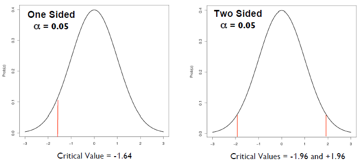

## Errors in Hypothesis testing
* alpha와 beta는 trade off 관계
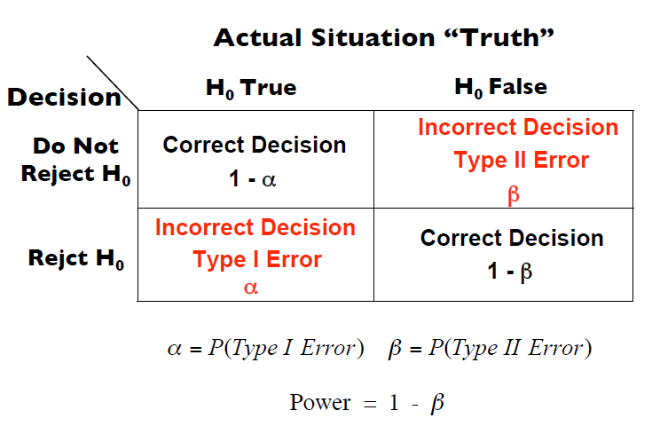

## Parametric and Non-Parametric Tests
### Parametric Tests
* 모집단이 normal distribution을 따른다고 가정

### Non-Parametric Tests
* Distribution Free (분포 무관)
* 이러한 가정 없이 주어진 데이터에서 직접 확률을 계산하여 통계학적으로 검정하는 방법

## Whirlwind Tour of One and Two Sample Tests
* Data type에 따라 parametric과 non parametric중에 어떤 검정을 해야하는지 가이드라인
* 표본이 하나일 때 모집단의 통계치와 표본집단의 통계치를 비교
* 두 표본간에 검정을 할 때는 표본간의 관계가 독립되냐 아니냐에 따라 나뉨
    * 여기서 독립이란 완전히 서로 다른 모수 (population을 가질 때때
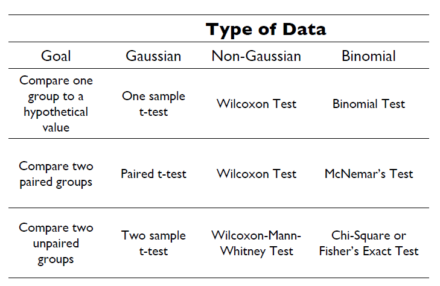

## General Form of a t-test
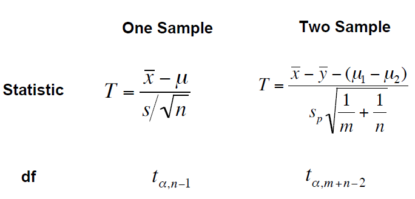

## Non-Parametric Alternatives
* Wilcoxon Test: non-parametric analog of one sample ttest
* Wilcoxon-Mann-Whitney test: non-parametric analog
of two sample t-test

## Hypothesis Tests of a Proportion
* 모비율 가설검정
    * 모평균과 마찬가지로 모비율인 p가 이럴것이다라고 설정된 2개의 가설중에서 하나의 가설을 선택하는 것
* Large sample test (prop.test)

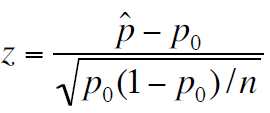

* Small sample test (binom.test)
    * Calculated directly from binomial distribution

## Confidence Intervals
* 추정 중인 파라미터에 대해 타당한 값의 간격
* 모수가 실제로 포함될 것으로 예측되는 범위
* 샘플링된 데이터를 기반으로 모수의 범위를 추정하기 위해 사용됨
=> 샘플링된 표본이 연구중인 모집단을 얼마나 잘 대표하는지 측정하는 방법
* General form  
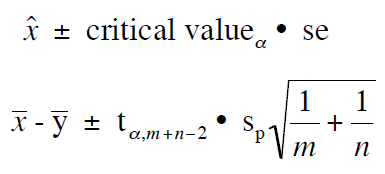

## Hypothesis Tests of 3 or More Means
* 3개 이상의 statistic을 검정할 때
* pairwise t-tests?

## Basic Framework of ANOVA
* 한개의 정량적인 독립변수에 대해서 1개 이상의 종속변수가 미치는 영향을 판단할 때 (이때 종속변수는 그룹)
* Want to study the effect of one or more qualitative variables on a quantitative outcome variable
    * Qualitative variables: __factors__  
    * Characteristics that differentiates factors: __levels__  

## One-way ANOVA
* 가장 단순
* single factor
* outcome variable: 비교하고자 하는 값
* factor variable: group을 나누는 categorical variable
* one way: 하나의 독립변수를 이용한 분산분석
* two way: 두개의 독립변수 (여러개의 level)을 이용한 분산분석
* k개 population의 평균이 서로 같다는 귀무가설을 테스트하는 통계적 방법

## Assumptions of ANOVA
* Independence
    * 표본이 독립적이어야 함
* Normality
    * 표본이 정규분포를 따름
* Homogeniety of variance은
    * 집단간 분산이 같아야함
    * 일반적으로 샘플수가 같은 경우에는 문제 x

## One-Way ANOVA: Null Hypothesis
* null hypothesis: 모든 평균이 같다
* alternative hypothesis: 하나의 평균이라도 다르다

## Motivating ANOVA
* 정량적인 랜덤한 표본이 모집단에서 랜덤하게 샘플링된 표본들에서 
* 정량적 특성을 가진 sample이 random하게 추출되었다는 가정
* AA, AG, GG라는 유전자

## Rationale of ANOVA (근거)
* 기본 idea: 데이터의 전체 variation을 두개로 분할
    * Variation within levels
    * Variation between levels
* 귀무가설이 옳다면 standardized variance는 둘이 같다

## 예제 풀이
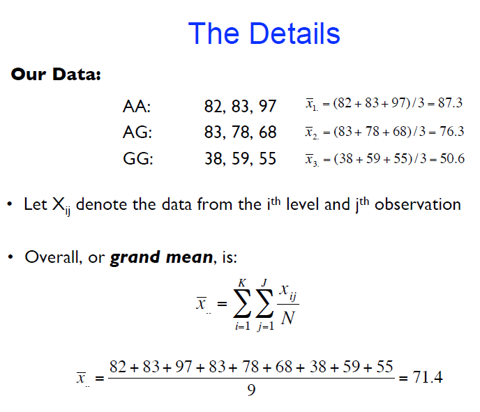
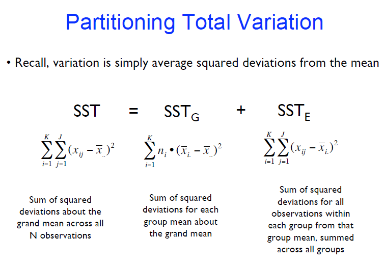
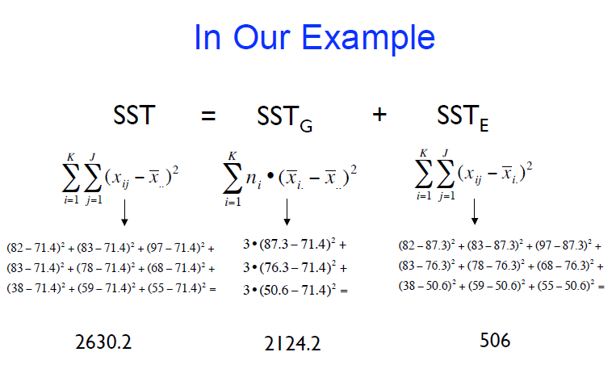
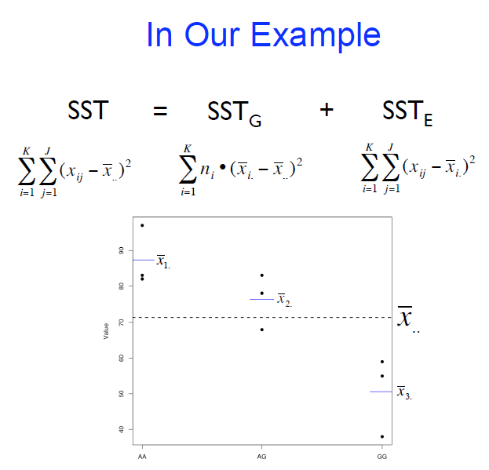
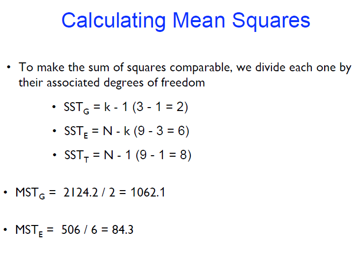
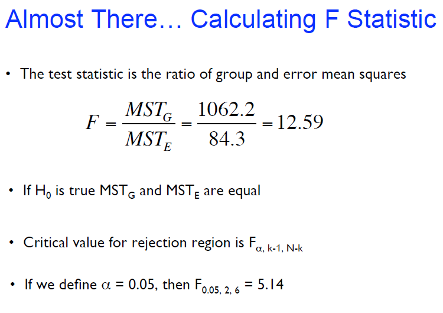
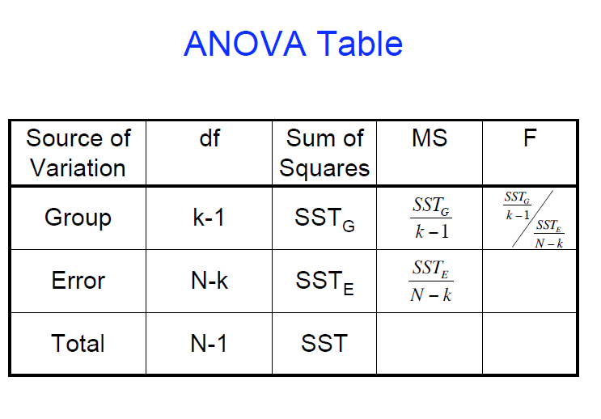

## Non-Parametric Alternative
* Kruskal-Wallis Rank Sum Test: non-parametric analog to ANOVA

## Futurework
* Non-parametric test

# References
* [Hypothesis testing and ANOVA](https://www.gs.washington.edu/academics/courses/akey/56008/lecture/lecture7.pdf)
* [귀무가설과 대립가설이란?](https://drhongdatanote.tistory.com/59#:~:text=%EC%9D%80%20%22%EA%B7%80%EB%AC%B4%EA%B0%80%EC%84%A4%EC%9D%B4%20%EA%B1%B0%EC%A7%93%EB%90%98%EB%8A%94%20%EA%B0%80%EC%84%A4%22%EC%9D%84%20%EB%A7%90%ED%95%A9%EB%8B%88%EB%8B%A4.)