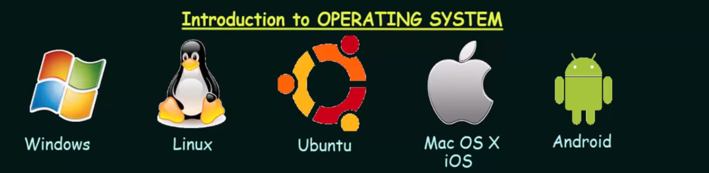

Operating Systems
=======
This file summary about Neso Academy OS course uploaded [here](https://www.youtube.com/playlist?list=PLBlnK6fEyqRiVhbXDGLXDk_OQAeuVcp2O).  

## Context
>[1.](#1.-introduction-to-operating-systems) Introduction to Operating Systems  

## 1. Introduction to Operating Systems

### OS
* computer harware를 제어하는 프로그램
* computer hardware: CPU, Memory, I/O devices 같은 resource
* 사용자와 computer hardware간의 매개채 역할을 하며 application program이 작동하게 하는 기반이 됨

### Type of OS
* Batch OS
* Time sharing OS
* Distributed OS
* Network OS
* Real Time OS
* Multi programming/ processing/ tasking OS

### Goals of OS
1. Convinience
2. Efficiency
3. Both

### Functions of OS
* Interface btw User and hardware
* Resource allocation
* Management of memory, security, etc